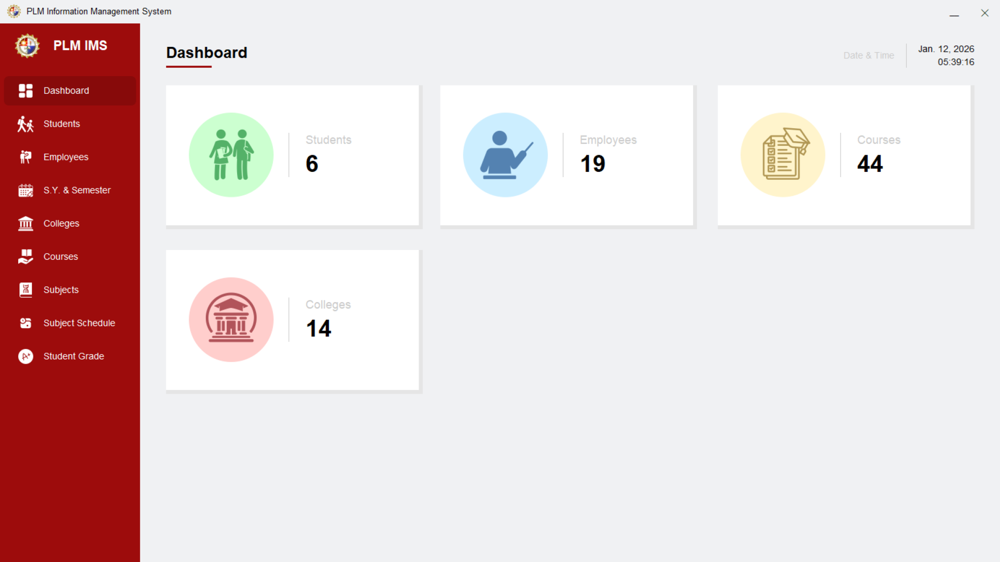

## University Records Management System
A desktop application developed in **Java** using **Swing (GUI)** and **Oracle Database**. This system is designed to streamline the management of colleges, courses, employees, and student records.

> ### Key Features
* **Academic Management:** Full CRUD operations for Colleges and Courses.
* **Personnel & Student Tracking:** Manage detailed records for students and staff.
* **Real-time Interface:** Dashboard features a live clock and intuitive navigation.
* **Dynamic Search:** Real-time data filtering across all modules using `DbUtils`.

> ### Tech Stack
* **Language:** Java (JDK 11+)
* **GUI:** Java Swing
* **Database:** Oracle Database 11g (Express Edition)
* **Libraries:** `ojdbc.jar` `rs2xml.jar`

<p align="center">
  
  
  
  
  
  
</p>

## Installation & Setup
### 1.) Database Configuration
Ensure your Oracle Database is running. You will need to create the required tables (Colleges, Courses, Students, etc.) in your schema.
### 2. External Libraries
You must add the following JAR files to your project's Library path in NetBeans:
- `ojdbc6.jar` (or higher)
- `rs2xml.jar`
### 3. Secure Credentials
To run this project, create a file named `config.properties` in the root directory. Add the following:

```properties
db.url=jdbc:oracle:thin:@localhost:1521:xe
db.user=YOUR_USERNAME
db.password=YOUR_PASSWORD
